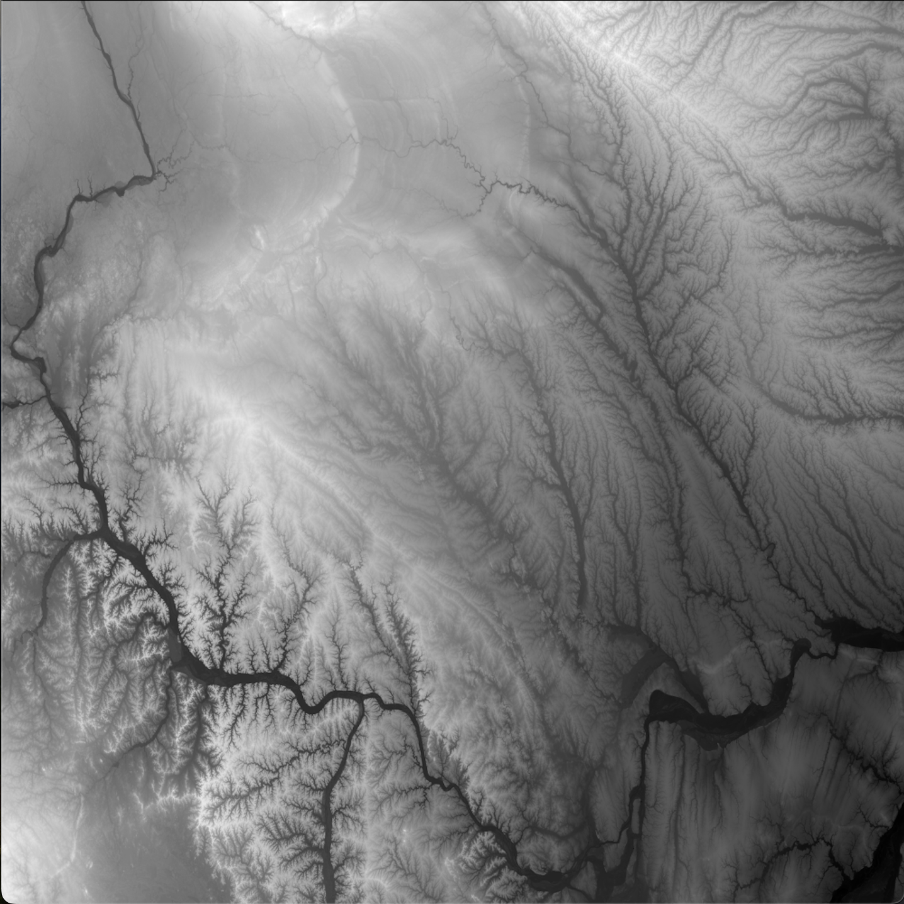
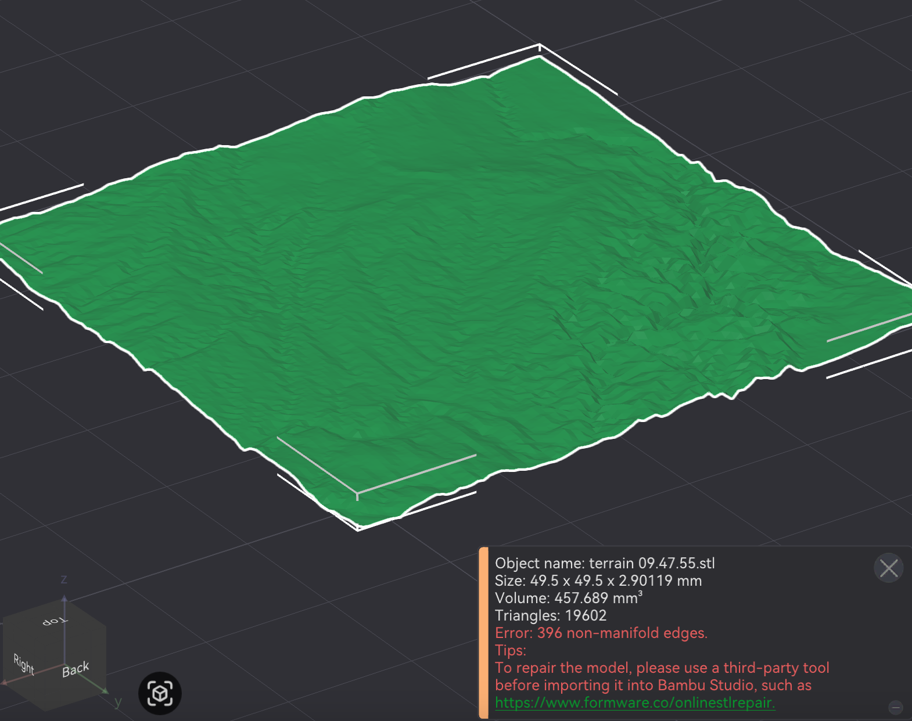
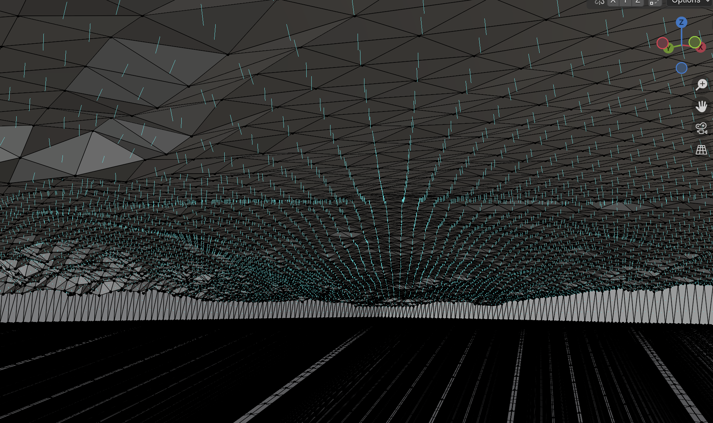
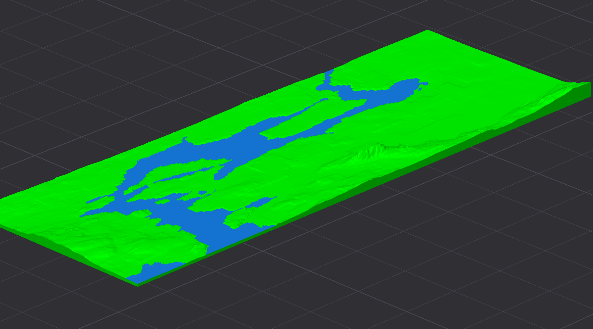
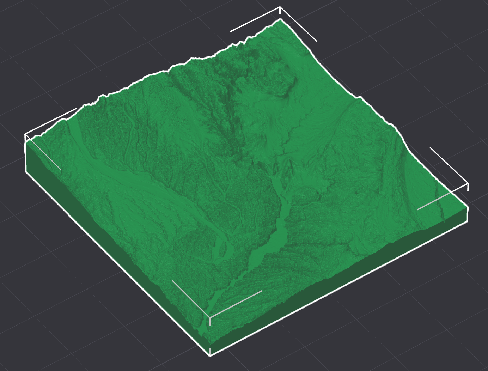

This week I started my project of 3D printing the planet under the supervision of Dr Michael Winston Dales. My aim for this week was to get a prototype up and running which took terrain data in the form of GeoTIFF, and outputs a 3D printable file. I started off slowly getting to grips with the various data sets and the basics of 3D printing (having never actually 3D printed something before). My first step to understanding what was actually going on with the data was to generate some simple 2D images, where the colour of each pixel corresponded to its height.

With a better understanding of what I was even looking at, I started writing some code to tesselate the different height values with triangles to get a mesh I could then import into Bambu Studio using the lib3mf library. However, when I tested the generated files, I was met with an error message complaining that my mesh was riddled with non-manifold edges.

I assumed from this that the problem was the lack of an enclosed volume, as at the time I was only generating the surface of the terrain. To fix this, I went back to my code to construct the sides and base for my surface to sit atop. Sadly, loading this new volume into the editor I was met with the same error message, this time with even more of these pesky non-manifold edges! After some research I learned that the problem was with the way that the normals to the triangles are implicitly defined through the ordering of its vertices. After loading it into Blender this problem became obvious as it showed all the normals pointing inwards. 

After finally fixing this problem by rewinding the triangles, the first prototype was up and running and I had a correctly formatted 3D printable file. The next thing I wanted to do was to add some water to my terrain to showcase the various rivers and lakes. As the Bambu Labs printers support multiple colours I thought it would be nice to utilise that for differentiating the water from the land. However, the problem with this is that Bambu Studio only accepts colour information from native files. I spent a long time trying to understand their system for colouring and how I could replicate it. In the end the solution was simpler but slightly messier than I initially thought. I had to scrap the lib3mf library and write my own code which directly modifies a preexisting file and reconstructs it in a way which tricks Bambu Studio into believing it is an unmodified native file. This allowed me to get my first coloured pieces of terrain.

This was a great improvement, however I was now faced with the problem of how to actually differentiate between land and water. I am still struggling with this problem as currently my naive approach of having a set height, for which everything below is considered water, is creating highly inaccurate representations of the terrain. Hopefully there is a dataset of rivers and lakes out there which I can use but for now I will have to stick with my current approach.
