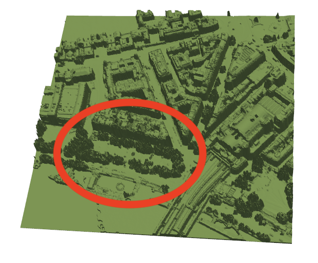
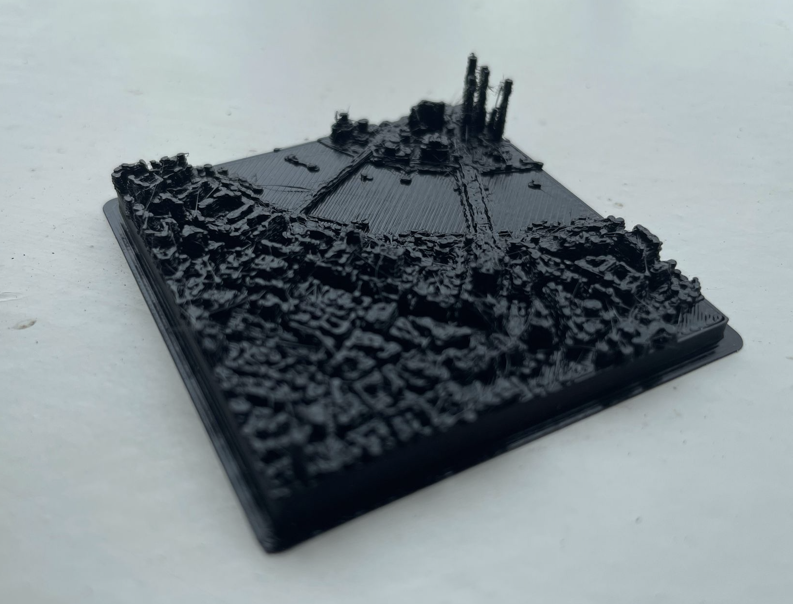
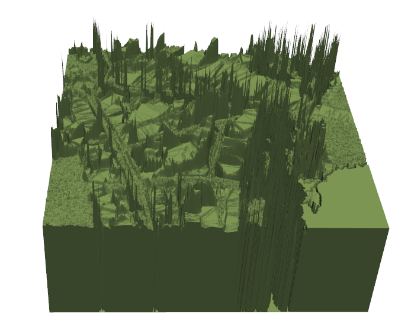
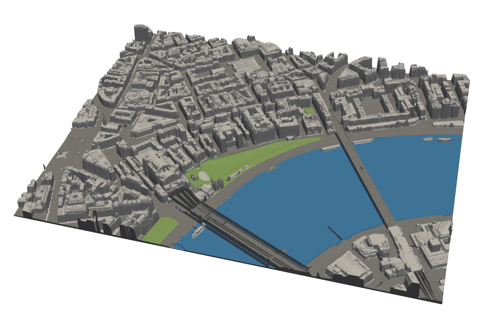

These last two weeks I've finally managed to get some code uploaded on PyPI and available for anyone to download and try out. If you do want to try it out, you can find out more information on the [github page](https://github.com/quantifyearth/topogmesh). If you run into any problems with the code feel free to add an issue to the github page and I will try to address it as soon as I possibly can. As this is just the first release I've tried to make it reasonably stable and only include the core functionalities of generating terrain for either entire .tif files or for a particular area specified by a .geojson file. In the future I plan on incorporating my more recent code so keep an ear out if you are interested in this project!

After a week of getting the code into a workable state for publishing, I was finally ready to go back to focusing on high resolution models of cities. To begin with I wanted a way to filter out some of the trees from the dataset as in their current form, they appear as noise and made it hard to distinguish between buildings and roads.

The workaround for this was to use the [government environmental data](https://environment.data.gov.uk/survey), which provides a height map of vegetation only, and subtract that from the original terrain to get a much cleaner looking model. This allowed me to get my first highly detailed print. I've learnt that it’s better to focus on a smaller area, as I think this print was a bit too ambitious (a friend had to ask me if it was a bombed city!).

On Monday 3rd, I had a meeting with Andrés Camilo Zúñiga González, who gave me some great ideas of how I could potentially apply some of the visualisations I'm working on to an active piece of research which he is doing on the impacts of urban vegetation on healthy cities. He talked about how he has been using OSM (OpenStreetMaps), which inspired me to incorporate the same dataset into my city visualisation code. Trying to set this up was a challenge due to having to convert back and forth between different global projections, and like everything to do with mesh generation, it created some sureal looking errors.

However after a while of bug fixing, I managed to get the data integrated and I'm finally able to do some detailed colour mapping. Due to the tag system OSM uses when querying their data, it is incredibly easy for me to assign colours to regions, ranging from accurately mapping river shapes to highlighting hospital buildings to make them stand out more in a print. This will allow for far more flexability for visualising cities and I'm looking to try do a multi-coloured print next week.

