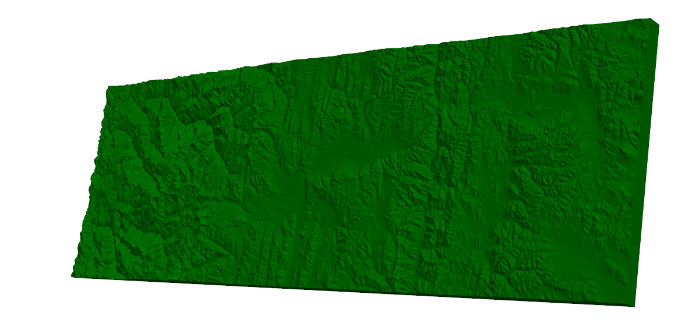
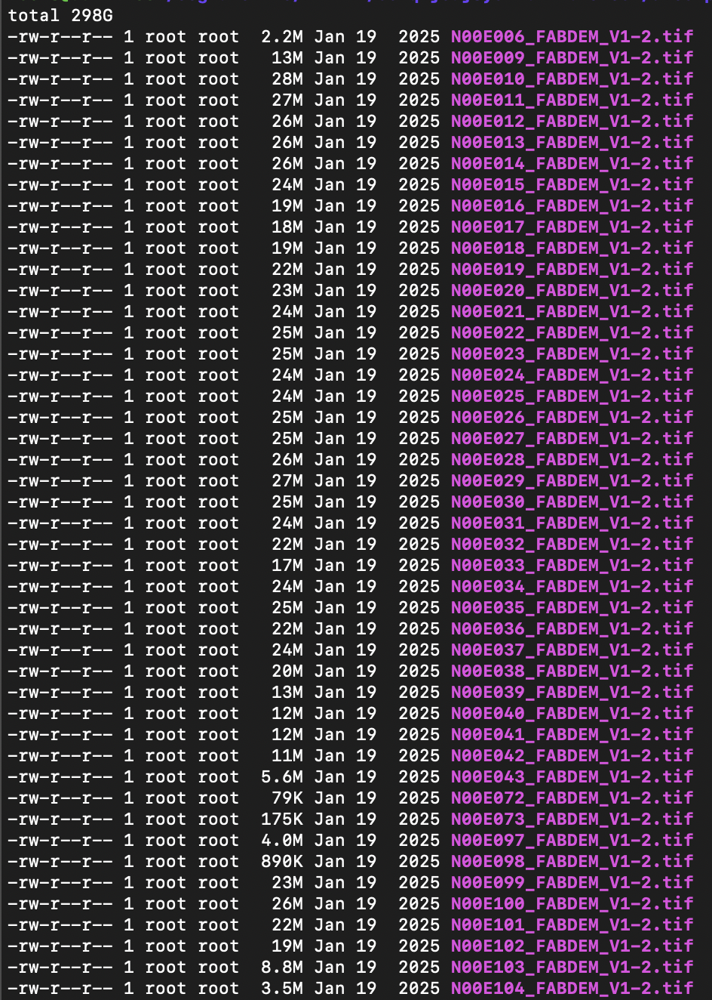
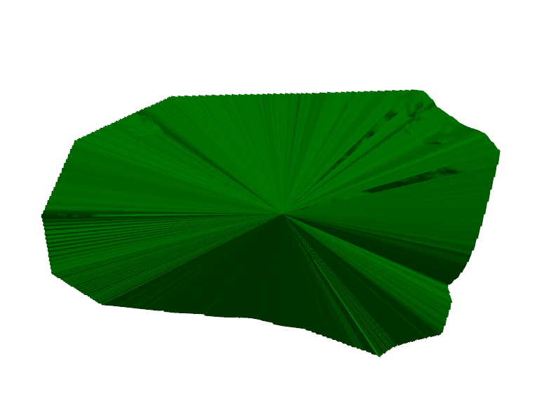
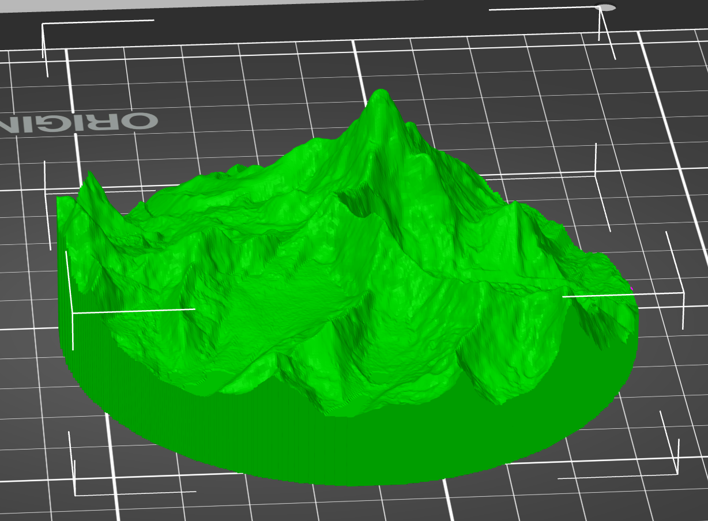

Second week into my project and I think that things are coming along nicely. I started off the week by taking a trip with Michael to the Cambridge Makespace where he showed me around the various pieces of equipment and explained some useful bits of information on 3D printing. He also helped me do my first 3D print of a model I had made in the week prior. It was a little rough around the edges but it was a good start and it was nice to having something I could physically hold and interact with.

My goal for this week was to have my code capable of taking any arbitrarily sized and shaped area of the globe and turning that into a 3D print file. To start, I had to move beyond my one file system and start stitching together many different files together in order to capture larger regions than what I was capable of creating before. To help with this I started using the FABDEM data which changed the precision of the data from 90m to 30m which made a noticeable improvement. The other advantange of this data is that it gave me access to elevation information anywhere* on the planet. For example this is a combination of 3 tiles which form part of the Himalayas.

This was a big step forward but it was becoming a real headache to manually download the specific files everytime I wanted to generate a new piece of terrain (not to mention my laptop's many complaints about running out of storage). So my next goal was to allow the code to access the entire 300Gb of elevation data without any intervention from myself. With this milestone achieved I could create a 3D print of any part of the earth no matter how large!

Squares and rectangles were starting to feel a bit dull after creating many of these models so I wanted to end off the week by allowing someone to create a 3D print of terrain for any arbitrary polygon. Sadly for me, this meant revisiting many pieces of old code to support what I thought would be a relatively simple change. I ran into many awkward artifacts and I'm sure even with my current code there are many nasty bugs and edge cases just around the corner like the one seen below.

Nearing the end of the week I had got this feature finished, but I am still looking to improve my code to deal with all shapes no matter how awkward they may be. The current workflow begins with QGIS, an open-source tool for visualising geospatial data, to select the area of the Earth you want to print. This selection is then exported into my program, which automatically generates a ready to print 3mf file. Using this process, I was able to create a model of Mount Everest in under two minutes which I could then leave to be printed.
